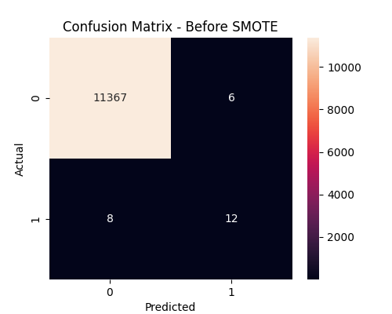
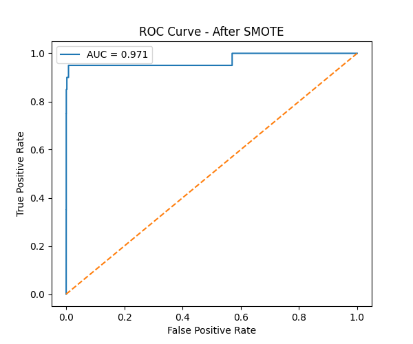
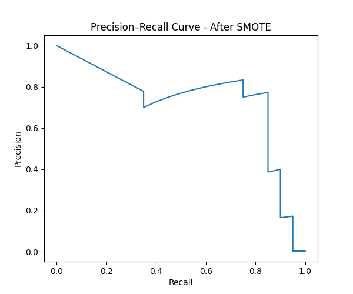
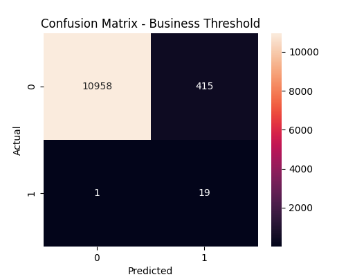
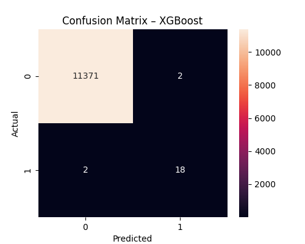
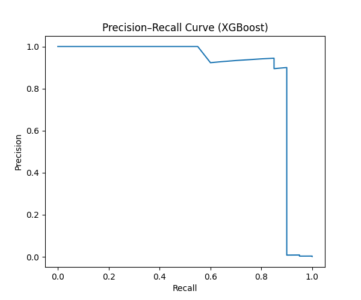
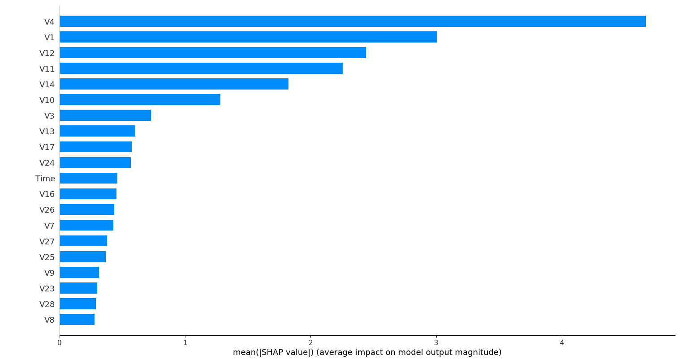
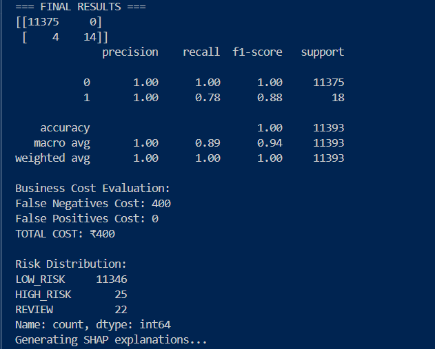
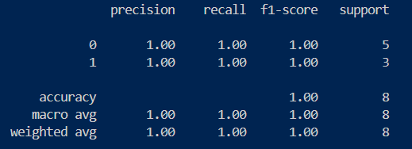

🚨 Credit Card Fraud Detection
Binary Classification | Imbalanced Learning | Business-Driven ML

  

Fraud detection is not a modeling problem — it is a decision-making problem under extreme imbalance.

This project demonstrates an end-to-end, production-oriented machine learning pipeline for detecting fraudulent credit card transactions, focusing on engineering choices, evaluation correctness, and business risk optimization.

🔥 Why This Project Matters

Fraud transactions are < 0.2% of all data

Accuracy is misleading

Missing fraud is financially expensive

Real systems care about recall, cost, and explainability, not leaderboard scores

This repository shows how fraud detection is actually done in the real world.

🧠 Problem Definition

We model fraud detection as a binary classification problem:
| Label | Meaning                |
| ----- | ---------------------- |
| `0`   | Legitimate Transaction |
| `1`   | Fraudulent Transaction |

📊 Dataset Overview (Numerical Transactions)

Dataset: Credit Card Fraud Detection

Source: Kaggle

File: creditcard.csv

Total Transactions: ~284,807

Fraud Cases: ~492

🔍 Features

V1 → V28: PCA-transformed anonymized features

Amount: Transaction value

Class: Target label

⚠️ Severe class imbalance (<0.2%) makes this dataset realistic and dangerous.

🧩 Core Challenges Addressed

✔ Extreme class imbalance

✔ Hardware & performance constraints

✔ Metric selection beyond accuracy

✔ Probability calibration

✔ Business-aware thresholding

✔ Model explainability (SHAP)

🤖 Models Implemented

1️⃣ Logistic Regression (Baseline)

Trained on original imbalanced data

Demonstrates why accuracy fails

📉 Result:

✔ High accuracy

❌ Almost zero fraud recall

2️⃣ Logistic Regression + SMOTE

Uses Synthetic Minority Over-sampling Technique

Balances learning without touching test data

📈 Result:

✔ Significant recall improvement

✔ Better minority-class learning

3️⃣ 🚀 XGBoost (Industry-Grade Model)

Implemented in xg_boost.py

✔ Captures non-linear fraud patterns

✔ Uses scale_pos_weight for imbalance

✔ Optimized using PR-AUC, not accuracy

📊 Outcome:

Best precision–recall tradeoff

Production-ready behavior

📈 Evaluation Metrics (Chosen on Purpose)

Accuracy is not used for decision-making.

| Metric    | Why It Matters                 |
| --------- | ------------------------------ |
| Precision | Avoid blocking legit users     |
| Recall    | Catch fraud (highest priority) |
| F1-Score  | Balance precision & recall     |
| ROC-AUC   | Ranking quality                |
| PR-AUC    | True performance on imbalance  |

🧠 Probability Calibration & Business Thresholding

Instead of using the default 0.5 threshold:

✔ Model probabilities are calibrated
✔ Precision–Recall curve is analyzed
✔ F1-optimal & cost-aware threshold is selected

🧮 Cost Matrix Logic

❌ False Negative (Missed Fraud) → High Cost

⚠ False Positive (Blocked Legit) → Lower Cost

This aligns predictions with financial reality, not math purity.

📊 Visual Evidence (Included)

| Visualization                   | Purpose                |
| ------------------------------- | ---------------------- |
| Confusion Matrix (Before SMOTE) | Shows imbalance damage |
| Confusion Matrix (After SMOTE)  | Recall improvement     |
| ROC Curve                       | Ranking capability     |
| Precision–Recall Curve          | Minority performance   |
| Business Threshold Matrix       | Cost-aware decisions   |
| XGBoost PR Curve                | Advanced model gains   |
| SHAP Plots                      | Model transparency     |

## 🖼️ Visual Results & Artifacts

| Image Preview | File Name | Description |
|--------------|----------|-------------|
|  | `before_smote.png` | Confusion matrix before SMOTE showing severe class imbalance |
|  | `after_smote.png` | Confusion matrix after SMOTE with improved fraud recall |
|  | `roc_curve.png` | ROC curve showing class separation capability |
|  | `pr_curve.png` | Precision–Recall curve highlighting minority-class performance |
|  | `bussiness_threesold.png` | Confusion matrix using business-optimized decision threshold |
|  | `xg_boost.png` | Baseline XGBoost model performance |
|  | `pr_xgboost.png` | Precision–Recall curve for XGBoost model |
|  | `xgboost_optimize.png` | Optimized XGBoost results after threshold tuning |
|  | `shap.png` | SHAP feature importance (global explainability) |
|  | `shap_Output.png` | SHAP output explaining individual predictions |
|  | `bert_nlp.png` | BERT-based NLP transaction classification preview |

🔍 Explainability with SHAP

✔ Feature-level contribution analysis

✔ Transaction-level decision explanation

✔ Required for banking & regulatory trust

This makes the model auditable, not a black box.

🧠 NLP-Based Fraud Detection (Text Transactions)

In addition to numeric data, the project includes an experimental NLP pipeline using BERT embeddings.

🔹 Dataset

File: data.csv

Samples: 20 (balanced)

Purpose: Learning & demonstration

🔹 NLP Flow

Transaction Text

→ BERT Tokenization

→ CLS Embedding

→ Binary Classifier

⚠️ This module demonstrates architecture, not real-world scale.

🛠️ Tech Stack

Python

NumPy, Pandas

Scikit-learn

Imbalanced-learn (SMOTE)

XGBoost

Matplotlib

SHAP

Transformers (BERT)

🚀 Key Engineering Takeaways

✔ Accuracy is misleading

✔ Recall beats precision in fraud

✔ SMOTE changes learning dynamics

✔ Thresholds matter more than models

✔ XGBoost dominates linear models

✔ Explainability is non-negotiable

🔮 Upcoming Updates (Work in Progress)

Ensemble learning (Logistic + XGBoost)

Hyperparameter optimization

Time-aware validation

Real-time prediction API (FastAPI)

Streamlit dashboard

Production-ready deployment flow

This commit is an update — more advanced versions are coming.

✅ Final Note

This project is not a toy ML notebook.

It reflects real-world fraud detection thinking — the kind expected in:

Technical interviews

Industry ML roles

Academic evaluation

Serious GitHub portfolios

⭐ If you understand why each decision was made here, you already think beyond beginner ML.
